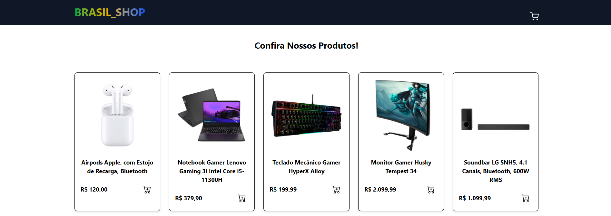

# 🛍️ BrasilShop

## E-commerce moderno desenvolvido com React + TypeScript



[](https://www.typescriptlang.org/)
[](https://reactjs.org/)
[](https://vitejs.dev/)
[](https://reactrouter.com/)
[](https://github.com/typicode/json-server)

---

## 📖 Sobre o Projeto

**BrasilShop** é um e-commerce completo desenvolvido para demonstrar habilidades em **React com TypeScript**, gerenciamento de estado, consumo de API e criação de interfaces responsivas. O projeto simula uma loja online real onde usuários podem navegar por produtos, adicionar itens ao carrinho e visualizar o valor total da compra.

✨ **Diferenciais técnicos:**
- Código 100% tipado com TypeScript
- Componentes reutilizáveis e modularizados
- Context API para gerenciamento global do carrinho
- Feedback visual com sistema de notificações
- Rotas protegidas e página 404 personalizada

---

## 🎯 Funcionalidades Implementadas

| Funcionalidade | Descrição | Status |
|---------------|-----------|--------|
| 🏠 **Home** | Listagem de produtos consumidos de uma API mock | ✅ |
| 🛒 **Carrinho** | Adicionar/remover produtos com atualização em tempo real | ✅ |
| 💰 **Total automático** | Cálculo dinâmico do valor total do carrinho | ✅ |
| 🔔 **Notificações** | Feedback visual para ações do usuário (Toast/Snackbar) | ✅ |
| 🚫 **404 personalizada** | Página amigável para rotas não encontradas | ✅ |


---

## 🛠️ Tecnologias & Ferramentas

### Front-end
- **React 18** com Functional Components e Hooks
- **TypeScript** - Tipagem estática e melhor manutenibilidade
- **React Router DOM v6** - Navegação SPA
- **Context API** - Gerenciamento de estado global do carrinho


### Desenvolvimento
- **Vite** - Build ultrarrápido e Hot Module Replacement (HMR)
- **JSON Server** - API REST mock para desenvolvimento

### Controle de Versão
- **Git** - Versionamento semântico
- **GitHub** - Repositório remoto

---

## 📦 Como Executar o Projeto

```bash
# 1. Clone o repositório
git clone https://github.com/Gabriell-Santos/BrasilShop.git

# 2. Acesse a pasta
cd BrasilShop

# 3. Instale as dependências
npm install

# 4. Inicie a API mock (JSON Server)
npx json-server --watch db.json --port 3001

# 5. Em outro terminal, inicie o front-end
npm run dev
